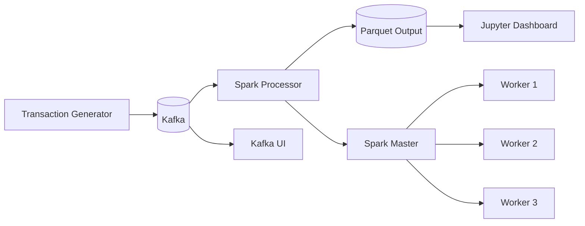

# TP5 — Real-time Banking Fraud Detection

**Course:** SID45 — Big Data Processing (ESP Nouakchott)  
**Academic Year:** 2025-2026

End-to-end streaming pipeline for Bank X: synthetic transactions → Apache Kafka → Spark Structured Streaming → live Jupyter dashboard.

## Architecture



## Technology Stack

| Component | Role |
|-----------|------|
| Apache Kafka | Transaction message bus (`bank-transactions` topic) |
| Kafka UI | Cluster monitoring (port 8080) |
| Spark 3.5.3 | 1 master + 3 workers, Structured Streaming |
| Python | Generator + processor + dashboard |
| Docker Compose | Full infrastructure orchestration |

## Simulation Parameters (Development Defaults)

The specification targets **N=100,000** Bank X clients and **M=200,000** external users. For local development we use smaller defaults (configurable via environment variables):

| Variable | Default (dev) | Production-scale |
|----------|---------------|------------------|
| `N_CLIENTS` | 2,000 | 100,000 |
| `M_EXTERNAL` | 4,000 | 200,000 |
| `PEAK_MULTIPLIER` | 5 | 10+ during peak hours |

**Rationale:** Smaller populations keep Docker memory usage manageable while preserving the same logic (power-law income, uniform spending, probabilistic ticks, balance updates, fraud injection).

### Distributions (as per TP spec)

- **Income:** power law \(P(I) \propto I^{-2}\) on [1,000 ; 1,000,000] MRU
- **Spending:** \(S_i \sim U[I_i/1000,\ I_i/100]\)
- **Balance:** \(B_i \sim U[0,\ 3 I_i]\)
- **Transaction probability:** \(p_i = f_i / (30 \times 24 \times 3600)\) with \(f_i = I_i / S_i\)

## Real-time Metrics

Per user (`send_id` / `receive_id`), the Spark processor computes:

| Category | Windows |
|----------|---------|
| Average amounts (sent/received) | 3h, 7d, 3w, 3mo (sliding) |
| Transaction counts | same windows |
| Network analysis | `approx_count_distinct` counterparties per window |
| Lifetime | totals, averages (hourly/daily/weekly/monthly), distinct counterparties |

Outputs are written under `data/output/` as Parquet for the notebook.

## Quick Start

```bash
docker compose up -d --build
```

| Service | URL / Port |
|---------|------------|
| Jupyter | http://localhost:8888 (token: `tp5fraud2026`) |
| Kafka UI | http://localhost:8080 |
| Spark Master UI | http://localhost:8081 |

Open `notebooks/fraud_dashboard.ipynb` and run all cells.

See [getting_started.md](getting_started.md) for detailed steps and sample logs.

## Repository Layout

```
├── docker-compose.yml
├── src/
│   ├── transaction_generator.py
│   └── spark_processor.py
├── notebooks/
│   └── fraud_dashboard.ipynb
├── docs/
│   └── architecture.md
├── spark/                 # Spark config (spark-defaults.conf)
├── data/output/           # Processor snapshots
└── checkpoints/           # Streaming checkpoints
```

## Scaling to Production Numbers

```bash
N_CLIENTS=100000 M_EXTERNAL=200000 PEAK_MULTIPLIER=10 docker compose up -d --build
```

Increase Spark driver/executor memory in `docker-compose.yml` before using full populations.

## Group Members

24034 Fatimetou Cheikh Brahim Cheikh Abdallahi
24062 Raiaa Vall El kheir
24063 Oumelkheir Ahmed Chemse
24402 Aminetou Mohamed Ebebe

## License

Academic project — ESP SID45.
